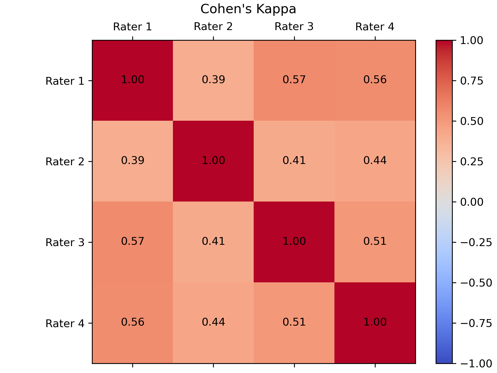

Cortical Surface Quality Control
================================

This repository contains a set of tools for performing quality control of cortical surface. 
In particular, it allows the user to 
1. Divide the dataset into groups of 50,
2. Create PDFs with 3D visualization of the cortical surface for each group, and
3. Create corresponding CSV files for manual quality control.
4. [NF] Now providing a tool for evaluating inter- and intra-rater reliability.

After running the appropriate scripts, for each group, a PDF is generated that looks something like this:


And you will also have a CSV file that allows you to manually record the quality of each surface.

Dependencies
------------
- PyVista
- Matplotlib
- NumPy
- pypdf
- tqdm
- scikit-learn
- pandas

To install the dependencies, run:

```bash
pip install pyvista matplotlib numpy pypdf tqdm scikit-learn pandas
```

Example
-------
This example demonstrates how to use the cortical surface quality control. 
Feel free to make appropriate changes to the example to fit the need of your own dataset.

Before starting, make sure you have all dependencies installed. 
Also make sure the dataset is organized in the following way, here is an example:

```
/home/kaibo/DATA
├── subid-001
│   ├── sesid-001
│   │   ├── lh.pial.vtk
│   │   ├── rh.pial.vtk
│   │   ├── lh.white.vtk
│   │   ├── rh.white.vtk
```

For the ease of performing quality control, we overlay cortical thickness `'thickness'` on pial surfaces with range `[0,5]`
and we overlay curvature `'curv'` on white surfaces with range `[-0.5,0.5]`. 
Therefore, the pial and white surfaces are expected to have these two scalar arrays.

To start, first divide the dataset into groups of 50 and create txt files for each group:

```bash
python create_groups.py
```

Running this command would create a folder `group` in the current working directory and 
create a txt file, e.g., `group/group_0.txt` for each group. 
To use this tool for your own dataset, you need to modify `create_groups.py` to fit your own dataset.

Next, to create a PDF and corresponding CSV file for, say group 0, run:

```bash
python create_folder.py 0
```

Or, to create PDF and CSV files for all groups, run:

```bash
for i in {0..216}
do
    python create_folder.py $i
done
```

For your own dataset, you need to change `216` to however many groups you have.

Note that the purpose of looping over all groups in bash instead of in Python is to avoid having too many visualizations opened at the same time.
When looping in bash, we are essentially terminating the Python script after saving the PDF and CSV files for each group. 
This is not intended to be a permanent or elegant solution, but it works as a workaround for now.
In fact, this is a known issue with PyVista, see [here](https://github.com/pyvista/pyvista/issues/1180).

Once in a while during quality control, one may want to evaluate the inter- and intra-rater reliability.
For example, say you have four raters, all of whom have rated the same group of subjects.
Suppose that rating is done using the CSV files generated by the above scripts.
Furthermore, suppose the CSV files are saved in the same directory as all the scripts.
For example,

```
/home/kaibo/Cortical_Surface_QC
├── cohen_kappa.py
├── rater_1.csv
├── rater_2.csv
├── rater_3.csv
├── rater_4.csv
```

Now, one can compute the pairwise Cohen's Kappa among all four raters by running:

```bash
python cohen_kappa.py
```

And the script should spit out Cohen's Kappa for all pairs of raters in an image named `kappa.png`,
and it should look something like this:


